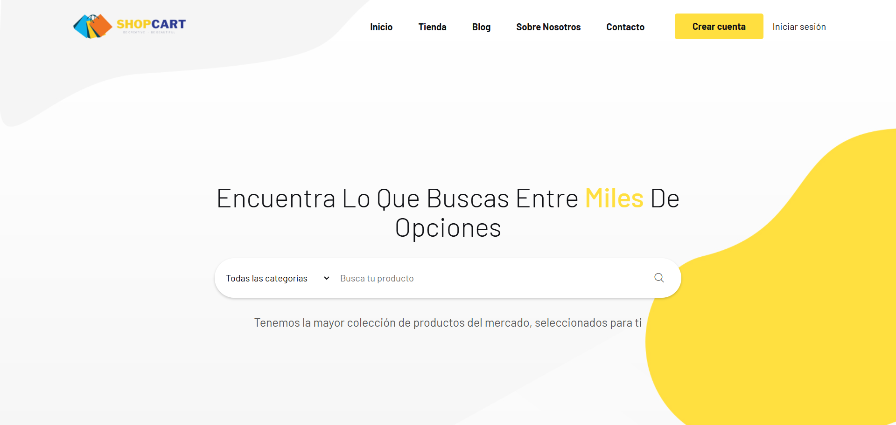

# SHOP CART 🛒🚀

[](https://shop-cart-web.netlify.app/)

**SHOP CART** es tu plataforma de compras en línea moderna, enfocada en productos deportivos y accesorios, con una selección complementaria de artículos para el hogar que aportan comodidad y estilo a tu vida diaria. Aquí encontrarás opciones cuidadosamente organizadas para que tu compra sea sencilla y agradable.
Con un diseño limpio y adaptable pensado para todo tipo de dispositivos, **Shop Cart** busca que cada usuario disfrute al máximo de su navegación, combinando rapidez, intuición y atractivo visual en cada visita.

---

## 🌟 Características Principales

- 🛍 **Catálogo organizado** por categorías para encontrar fácilmente lo que buscas.
- 📱 **Diseño responsive**, adaptado para móviles, tablets y computadoras.
- 🎨 **Estilo visual moderno**, con tipografía clara e imágenes optimizadas.
- 🔐 **Registro e inicio de sesión** con autenticación segura mediante **Firebase**.
- ☁ **Despliegue en la nube** para acceso rápido desde cualquier lugar.
- ⚡ **Rendimiento optimizado** con **Vite** y carga eficiente de recursos.

---

## ❓ Origen de Shop Cart

El nombre **Shop Cart** representa la simplicidad y el enfoque en la experiencia de compra. La idea detrás de este proyecto es combinar **facilidad de uso** con **tecnología moderna**, permitiendo que cualquier usuario pueda navegar, explorar y comprar sin complicaciones.

Más que una simple tienda en línea, **Shop Cart** busca ser una herramienta **versátil y escalable**, lista para adaptarse a diferentes tipos de productos y públicos.

---

## 🛠️ Tecnologías Utilizadas 👨‍💻

| HTML | CSS | JavaScript | React | Bootstrap | Sass | Vite | Node.js | Firebase | ESLint |
|------|-----|------------|-------|-----------|------|------|---------|----------|--------|
|  |  |  |  |  |  |  |  |  |  |

---

## 🚀 Instalación y Uso Local

Sigue estos pasos para clonar y ejecutar el proyecto en tu máquina local:

1. **Clona el repositorio:**
    ```bash
    git clone https://github.com/carlozzsilva10/shop-cart
   ```

2. **Entra en el directorio del proyecto:**
    ```bash
    cd shop-cart
   ```

3. **Instala las dependencias necesarias:**
    ```bash
    npm install
   ```

4. **Ejecuta la aplicación en entorno de desarrollo:**
    ```bash
    npm run dev
   ```

5. **Abre tu navegador y visita:**
    ```
    http://localhost:5173
    ```

---

## 📩 Contacto

Si tienes alguna pregunta o sugerencia, puedes encontrarme en:

- 🌐 [Mi GitHub](https://github.com/carlossilvadev10)
- 📧 Email: [carlos.esilva1007@gmail.com](mailto:carlos.esilva1007@gmail.com)
- 💼 [Mi LinkedIn](https://www.linkedin.com/in/carlos-eduardo-silva-bustamante-b6084528b)

---

📌 *SHOP CART - Compras rápidas, simples y seguras.*